# Crypto AI Terminal

<p align="center">
  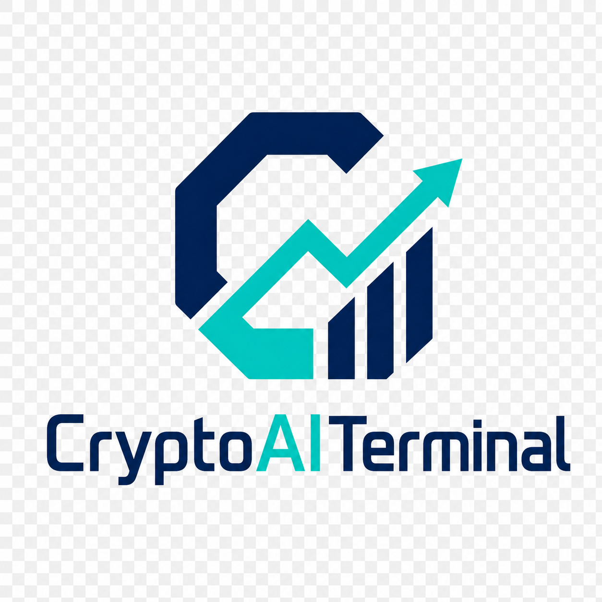
</p>

<p align="center">
  
  
  
  
  
  <a href="https://github.com/090TYPE/CryptoAI/actions/workflows/ci.yml"></a>
</p>

> **A desktop terminal for crypto trading — centralised exchanges and on-chain DEX in one window.**
> Manual trading, algorithmic bots, a new-listing sniper, portfolio and risk tooling, and AI
> assistance throughout. Paper trading is the default; live execution sits behind an explicit switch.
>
> ⚠️ **Not financial advice.** Trading crypto carries substantial risk of loss.
> 📄 Source-available for review — see [LICENSE](LICENSE). Commercial use requires permission.

---

> **Десктоп-терминал для торговли криптовалютами — биржи и он-чейн DEX в одном окне.**
> Ручная торговля, алгоритмические боты, снайпер новых листингов, портфель и риск-контроль,
> AI-помощники по разделам. По умолчанию всё в бумажном режиме.

---

## Содержание

- [Что это такое](#что-это-такое)
- [Торговля](#торговля) — Dashboard · Markets · Trading · AI Signals · Sniper
- [Портфель](#портфель) — Portfolio · Positions · Risk
- [Автоматизация](#автоматизация) — Bots · Rules · Backtest · Journal
- [Арбитраж и копирование](#арбитраж-и-копирование) — Funding · Arb · Copy · Stat Arb
- [Данные и аналитика](#данные-и-аналитика) — News · On-Chain · Whales · Live Tape · Liq Map · Analytics
- [Инфраструктура](#инфраструктура) — Gas · Router · Scanner · Settings
- [Как устроено](#как-устроено)
- [Быстрый старт](#быстрый-старт)
- [Режимы и безопасность](#режимы-и-безопасность)

---

## Что это такое

Терминал собирает в одном окне то, ради чего обычно держат несколько вкладок в браузере: стакан
и график биржи, кошелёк и своп на DEX, открытые позиции, ленту новостей, он-чейн метрики. Сверху —
автоматизация: от правил «если цена выше, то уведомить» до ботов, которые ведут сетку или усредняют
позицию без участия человека.

Работает с двумя мирами сразу. **Биржи** — Binance, Bybit, OKX, KuCoin, спот и бессрочные фьючерсы;
ключи хранятся локально в зашифрованном виде и никуда не отправляются. **On-chain** — EVM-сети,
Solana и Tron: свопы через агрегаторы и напрямую через роутеры, плюс перпетуалы Hyperliquid.

AI встроен как слой, а не как отдельная вкладка: разбор графика, сводка новостей, проверка токена
перед покупкой, чат-помощник и автономный агент, который может сам выставлять ордера в рамках
заданных лимитов. Модель выбирается переключателем — Claude или ChatGPT. Интерфейс двуязычный,
русский и английский переключаются на лету.

Ниже — все 26 разделов терминала. Скриншоты сняты с работающего приложения; часть таблиц пуста,
потому что в этой сессии не подключены ключи бирж.

---

## Торговля

### Dashboard

Стартовый экран — сетка виджетов, которая настраивается перетаскиванием. Сверху сводка по выбранной
паре: последняя цена, лучший бид и аск, изменение, экстремумы, диапазон сессии, спред. Ниже вотчлист
с трендом по каждой монете, график цены с переключением таймфрейма, карта ликвидаций, стакан.
В нижнем ряду — настроение рынка (индекс страха и жадности, открытый интерес, подразумеваемая
волатильность, средний фандинг), монитор газа и лента AI-сигналов.

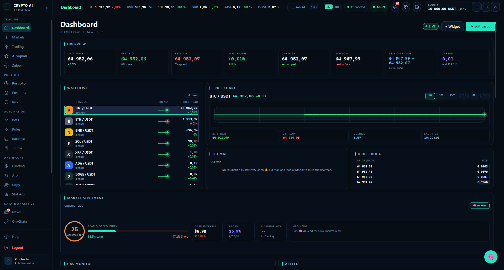

### Markets

Список торгуемых инструментов. Верхняя полоса — общерыночные показатели: капитализация, объём,
доминация BTC и ETH, открытый интерес, фандинг, TVL в DeFi, индекс альтсезона. Слева фильтры
(все, CEX, DEX, избранное, растущие, падающие), сортировка, добавление монеты и блок лидеров:
сильнейший, слабейший, самый активный, с самым узким спредом. В центре таблица с ценой, изменением,
объёмом, капитализацией и мини-графиком, справа карточка выбранного рынка со стаканом.

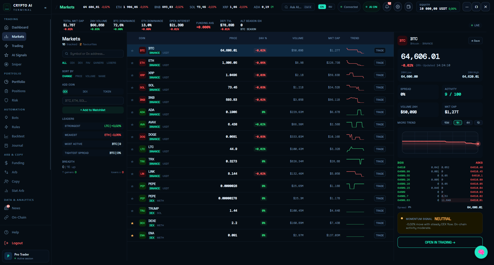

### Trading

Главный торговый стол. Слева тикет ордера: выбор символа, тип (рыночный, лимитный, стоп), режим
(спот или фьючерсы), цена, размер слайдером и пресетами, тейк-профит и стоп-лосс, профиль торговли,
расчёт комиссии и итоговой суммы. В центре график со свечами, индикаторами и инструментами разметки.
Справа стакан, лента сделок, карточка позиции и AI-сигнал по инструменту. Внизу блоттер: ордера,
позиции, исполнения, сигналы. Стол переключается между CEX и DEX кнопками в шапке.

Плашка `EXECUTION BLOCKED` справа вверху означает включённый бумажный режим — ордера на биржу не уходят.

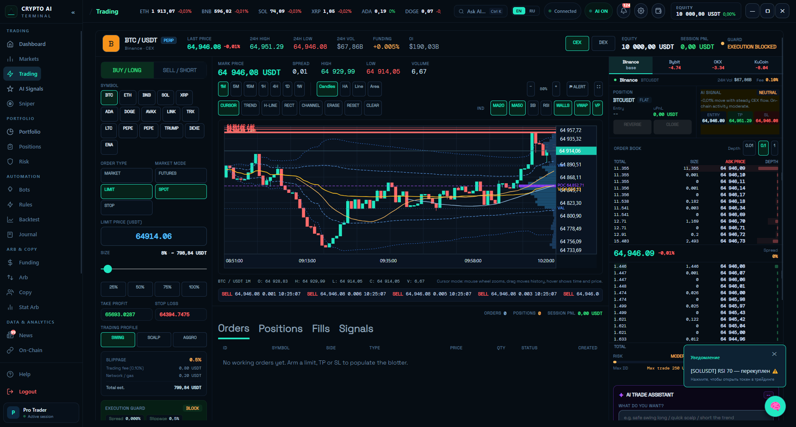

### AI Signals

Лента сигналов по отслеживаемым парам: направление, уверенность, короткое обоснование. Рядом оценка
рыночного режима, дайджест новостного фона и список возможностей. Ниже тепловая карта по шести
таймфреймам сразу — видно, где сигналы согласованы, а где расходятся. Справа детальная карточка
выбранного сигнала с метаданными и вкладками: сам сигнал, TP/SL, парная торговля, коуч и чат.

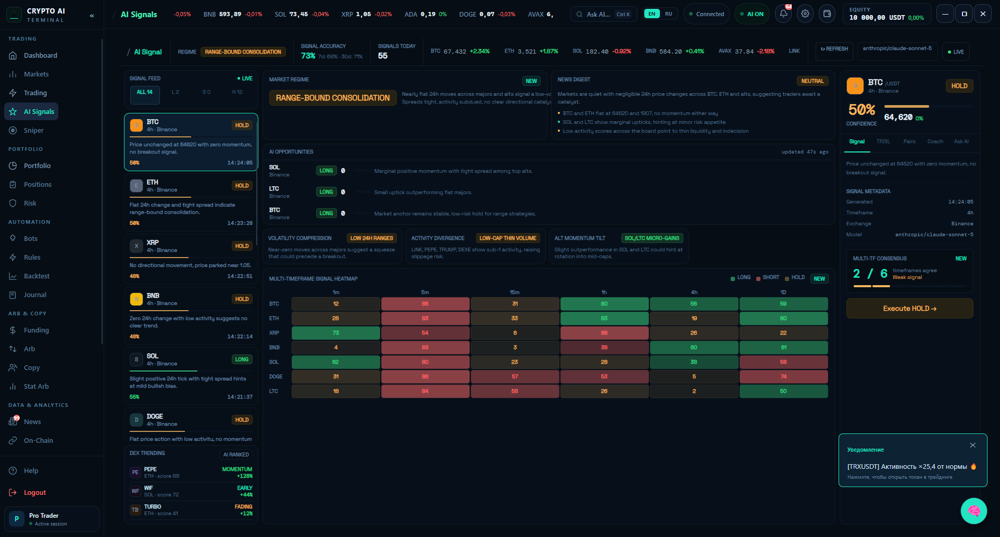

### Sniper

Снайпер новых листингов на DEX. Слева режим сканера и профиль риска (три пресета), режим исполнения
с набором переключателей: автопокупка принятых пар, бумажный режим, авто-продажа по тейку, стоп-лосс,
трейлинг, требование нативной котировки, страж исполнения, блокировка honeypot-токенов, глубокий
скан безопасности. В центре поток свежих пар с фильтрами по ликвидности, возрасту и риск-скору;
вкладки разделяют тренд, свежие пары, принятую очередь, открытые и бумажные позиции.

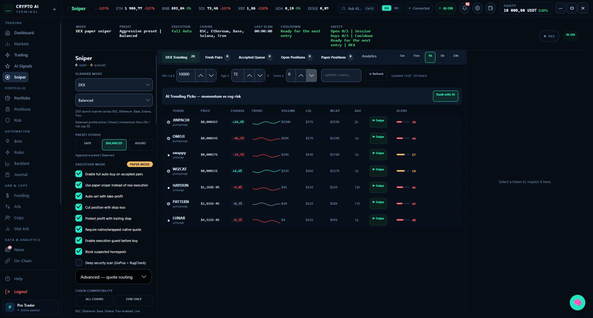

---

## Портфель

### Portfolio

Менеджер нескольких кошельков. Сводка сверху: общий капитал, результат за сутки, нереализованный
результат, доход от стейкинга, число открытых позиций. Карточки показывают лучший кошелёк за сутки,
уплаченные комиссии и индекс риска. Ниже распределение по типам кошельков и топ активов, вкладки
с активами, активностью, мемкоин-радаром, стейкингом и ребалансировкой. Справа панель выбранного
кошелька: подключение сессии, проверки, токены, история и выданные разрешения.

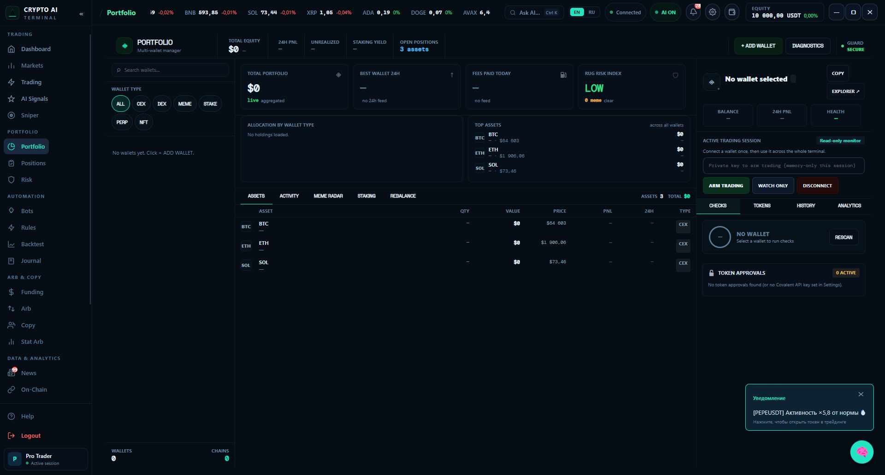

### Positions

Все открытые позиции со всех подключённых площадок в одной таблице: биржа, символ, сторона, цена
входа, текущая, размер, плечо и цена ликвидации, нереализованный результат. Закрытие целиком или
частями, отдельная кнопка аварийного закрытия всего. На снимке таблица пуста — в сессии не подключены
ключи бирж.

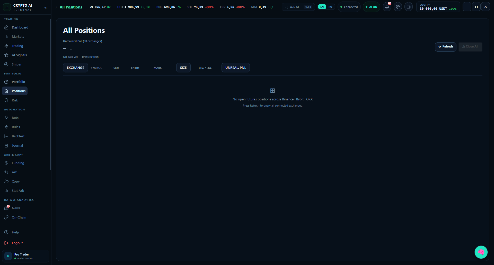

### Risk

Центр управления риском. Вверху страж исполнения — `PAPER ONLY` или `LIVE ALLOWED`, бюджет риска
и состояние снайпера. Ниже реализованный и открытый результат, число позиций, винрейт. Основной блок —
жёсткие лимиты, которые проверяются перед каждым биржевым ордером: максимальная позиция и экспозиция,
дневной лимит убытка. Отдельно траектория дневного убытка, журнал заблокированных ордеров и быстрые
переключатели режима.

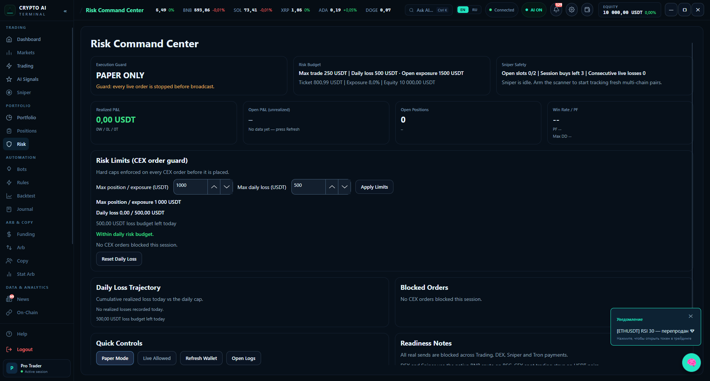

---

## Автоматизация

### Bots

Консоль движков. Шесть типов: сеточный бот, DCA, бот по правилам, AI-трейдер, автономный агент
и трейлинг-стоп. Таблица показывает площадку и рынок, режим (бумажный или живой), состояние, результат
за сутки и всего, исполнения, бюджет, максимальную просадку и время работы; в строке — кнопки запуска,
паузы, остановки и настроек. Справа рельс с AI-инструментами: проверка риска, корреляционная сводка,
советник по опционам, копилот и автономный агент.

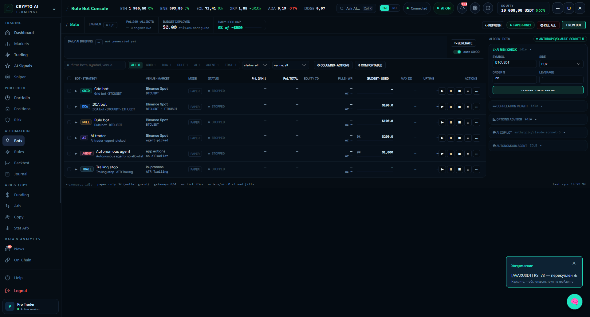

### Rules

Конструктор правил «условие → действие» без кода. Правило можно описать обычным текстом — примеры
подсказок прямо под полем. Список правил показывает условие, действие, кулдаун и когда правило
срабатывало в последний раз; правила включаются и выключаются по одному. Внизу журнал срабатываний.

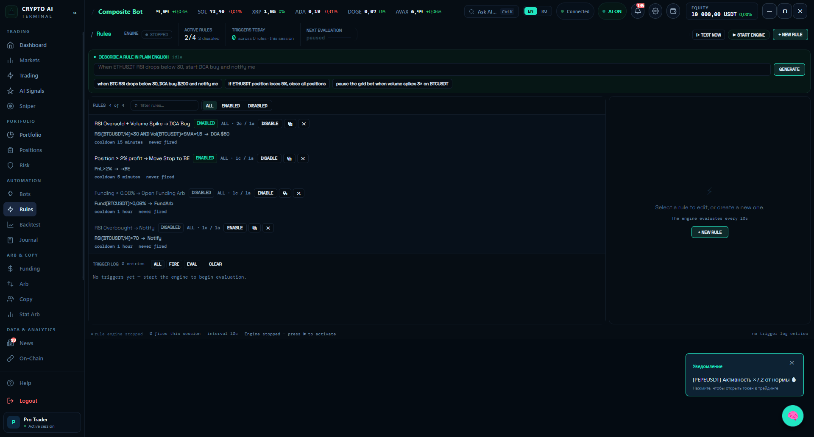

### Backtest

Прогон стратегии по истории. Сверху конфигурация: инструмент, таймфрейм, комиссия, стратегия, число
свечей и параметры. Результат — кривая капитала стратегии против простого удержания, лучшая и худшая
сделка, сводка одной строкой: винрейт, доходность, просадка, Sharpe. Ниже оптимизатор по окнам
(walk-forward) и симулятор Монте-Карло, выгрузка в CSV и разбор результата моделью.

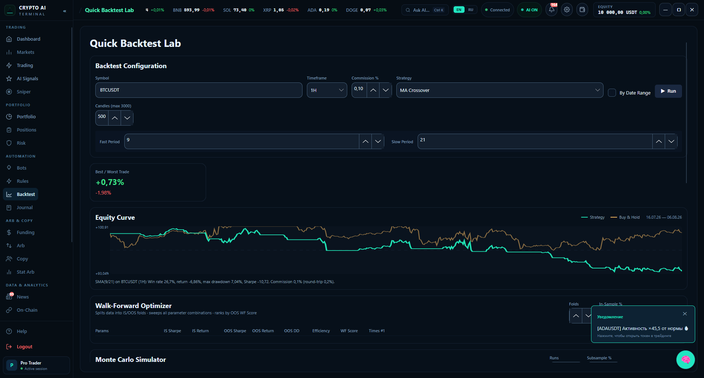

### Journal

Журнал закрытых сделок с заметками и тегами, фильтрами по периоду и поиском, разбивкой по тегам
и выгрузкой в CSV. Отдельная кнопка — разбор торговли моделью.

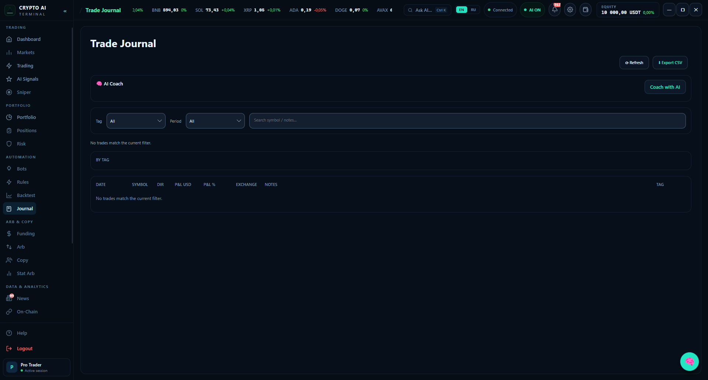

---

## Арбитраж и копирование

### Funding

Ставки финансирования по биржам и инструментам с годовыми, временем следующей выплаты и историей.
Ниже бот фандинг-арбитража: стратегия «лонг спот плюс шорт перпетуала» ловит выплаты каждые восемь
часов. Настраиваются минимальная ставка, номинал, плечо и автоматический реинвест собранного дохода.
Список живых возможностей — с кнопкой открытия пары.

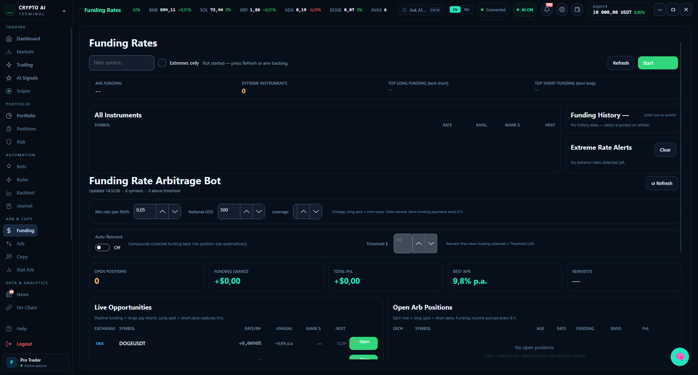

### Arb

Межбиржевой арбитраж на споте. Таблица сравнивает бид и аск на Binance, Bybit и OKX по каждому
символу, показывает лучшую покупку и продажу, валовый спред и чистый — уже за вычетом комиссий обеих
ног. Настраиваются минимальный чистый спред, номинал и тейкерская ставка; исполнение вручную или
автоматически.

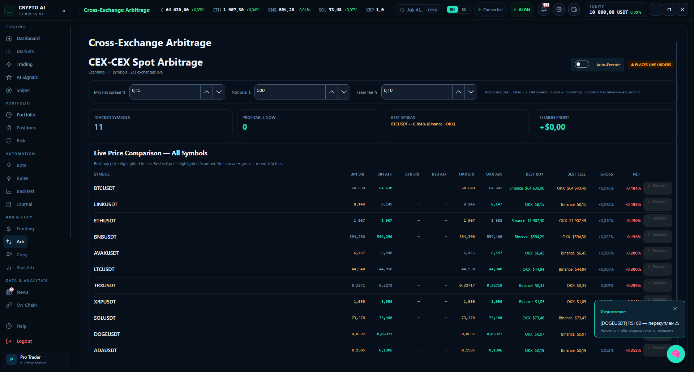

### Copy

Копирование сделок в двух режимах. Лидер публикует свои закрытые сделки, последователь опрашивает
лидера и зеркалит их с масштабированием. Отдельно — наблюдение за чужими кошельками: адрес, метка,
сеть, и оповещения при их покупках и продажах.

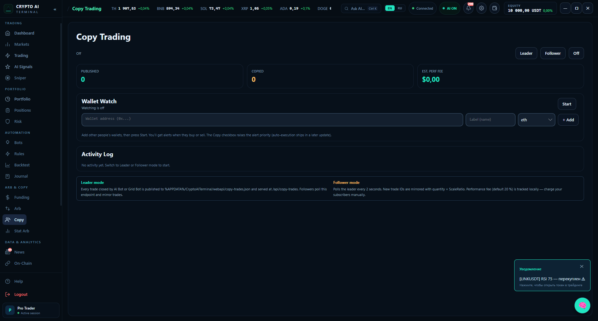

### Stat Arb

Парный арбитраж. Задаются два инструмента, окно расчёта, пороги входа и выхода по z-оценке и номинал.
Движок считает спред как логарифмическую разницу с коэффициентом хеджирования, открывает
дельта-нейтральную пару при расхождении и закрывает при возврате к среднему. Пояснения к стратегии,
коэффициенту и рискам — прямо на экране.

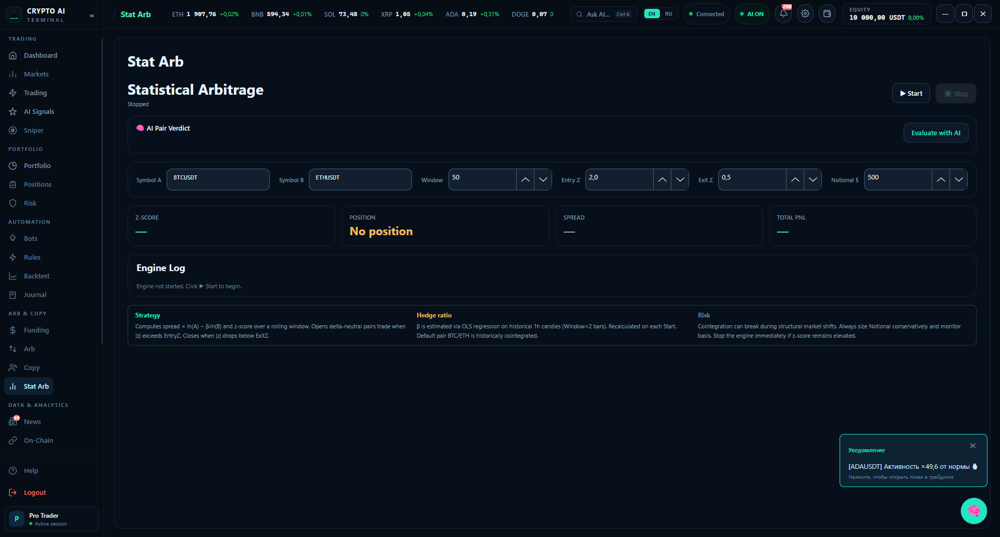

---

## Данные и аналитика

### News

Лента новостей из нескольких источников с оценкой тона каждого заголовка и отметкой важных. Фильтры
по настроению и по монетам, счётчик непрочитанного, дайджест от модели. Справа сводка нарратива
с числовой оценкой и разбивка по монетам, которые сейчас в новостях.

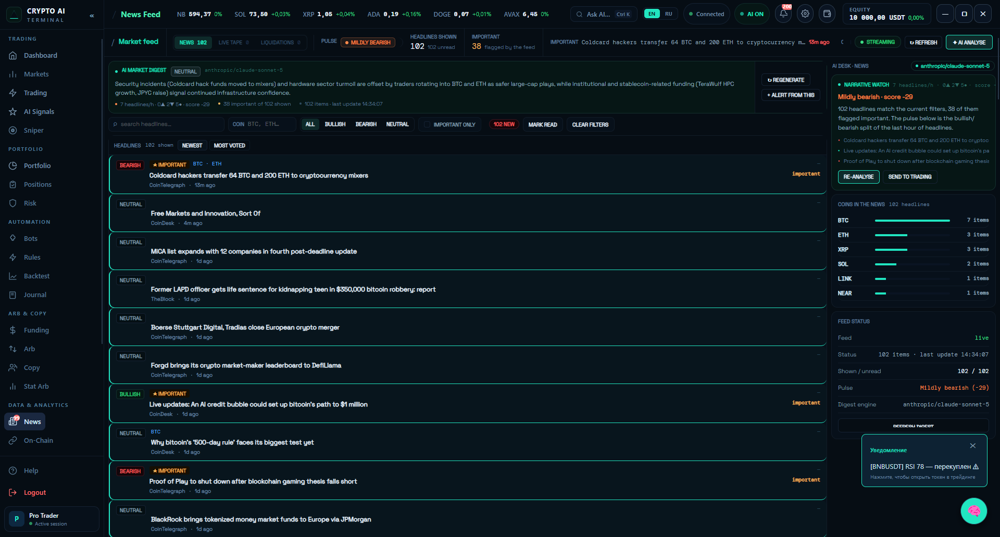

### On-Chain

Он-чейн метрики по биткоину и эфиру из CoinMetrics: MVRV с интерпретацией зоны, NUPL от капитуляции
до эйфории, чистый поток на биржи и реализованная цена. Ключ не требуется. Отдельная кнопка — разбор
показателей моделью.

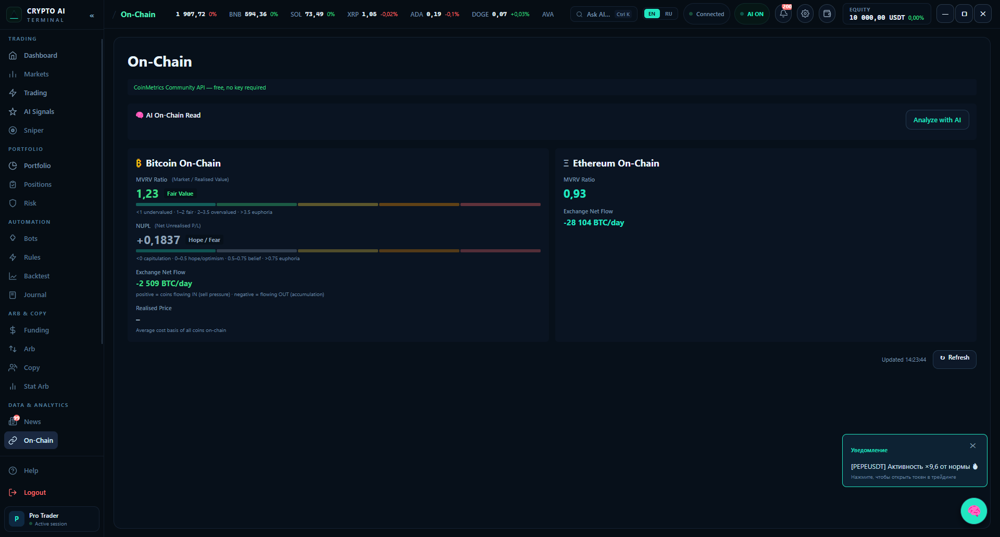

### Whales

Отслеживание крупных переводов по Ethereum, BSC и Solana. Задаётся минимальная сумма перевода; список
известных кошельков включает биржевые холодные и горячие адреса и маркетмейкеров, так что в алерте
видно не только сумму, но и кто отправитель. Отдельная кнопка — интерпретация потоков моделью.

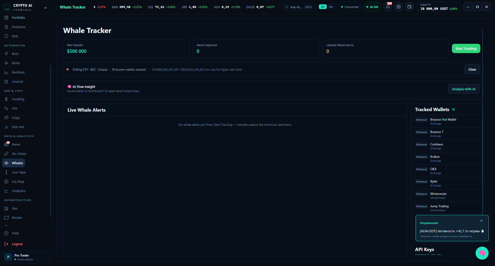

### Live Tape

Лента чужих сделок. Для биржи это анонимные исполнения по символу, для DEX — свопы в пуле вместе
с адресом кошелька. Крупные печати подсвечиваются, порог настраивается; сверху соотношение покупок
и продаж за окно.

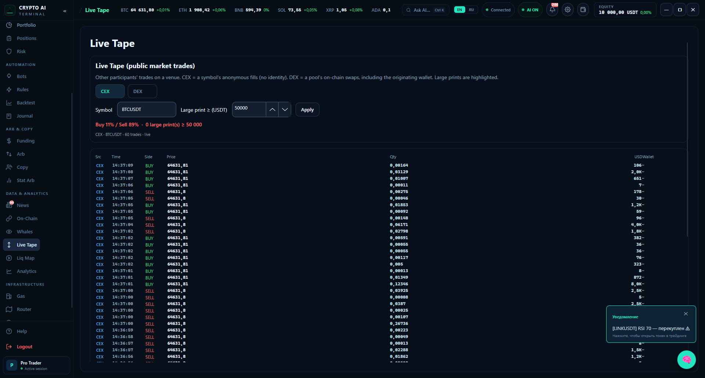

### Liq Map

Карта скоплений ликвидаций вокруг текущей цены: где сосредоточены длинные позиции, а где короткие.
Уровни считаются по модели плеча (о чём честно написано в шапке) либо берутся из внешнего источника.
Предупреждение вверху срабатывает при приближении цены к крупному кластеру.

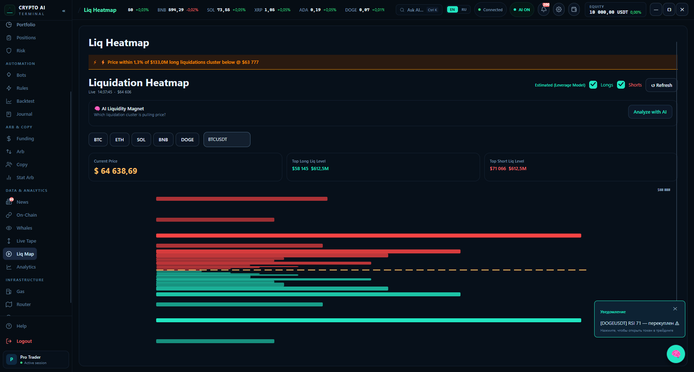

### Analytics

Разбор собственной торговли. Чистый результат за период, винрейт, средняя прибыль и убыток,
максимальная просадка, профит-фактор. Кривая капитала с наложенной просадкой и сравнением с простым
удержанием, разбивка результата по источникам, активам и дням, полная история сделок. Справа
риск-метрики — Sharpe, Sortino, Calmar, ожидание, отношение выигрыша к проигрышу — и распределение
результатов.

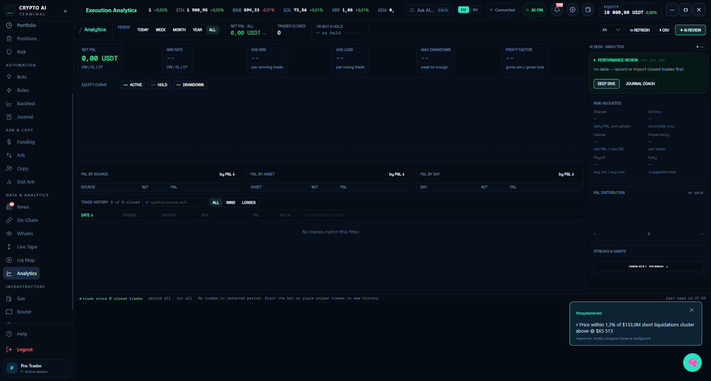

---

## Инфраструктура

### Gas

Стоимость газа по сетям: три тарифа для Ethereum и BNB Chain с оценкой времени подтверждения, для
Solana — пропускная способность сети. Порог оповещения настраивается, сверху подсказка, подходящий ли
сейчас момент для крупного свопа.

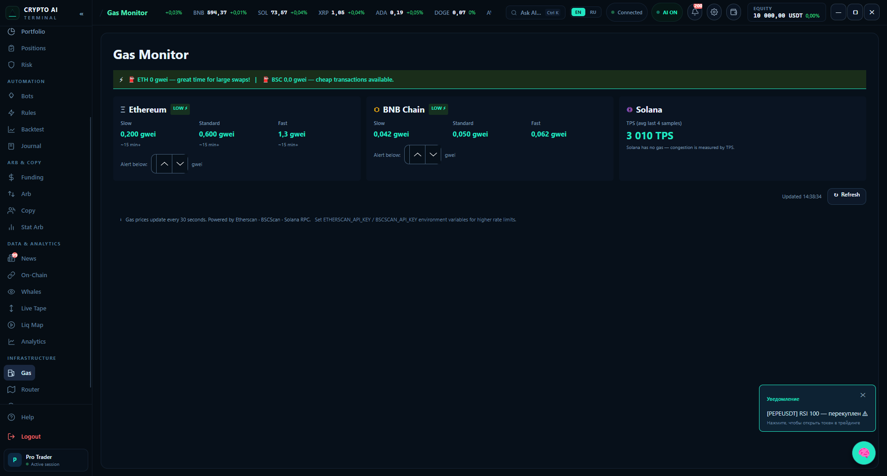

### Router

Подбор лучшего исполнения. По заданному размеру сравниваются цены Binance, Bybit и OKX с учётом
комиссий и доступной ликвидности, отмечается лучшая площадка. Крупная заявка автоматически дробится
между биржами, а план исполнения показывает долю каждой, среднюю цену и экономию против худшего
варианта. Отдельно — планировщик срезов по срочности.

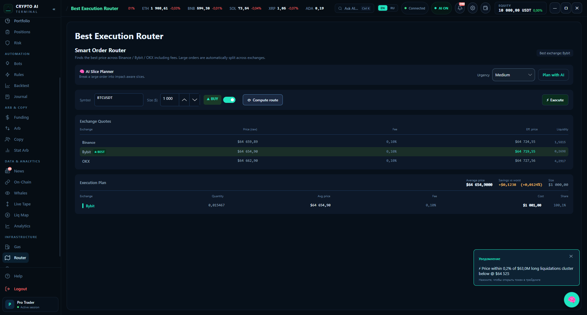

### Scanner

Сканер рынка в реальном времени. Пресеты — горячие, растущие, падающие, перепроданные, перекупленные;
фильтры по изменению, RSI и объёму. Клик по строке открывает инструмент в торговле. Справа лента
сработавших оповещений и заданные ценовые уровни.

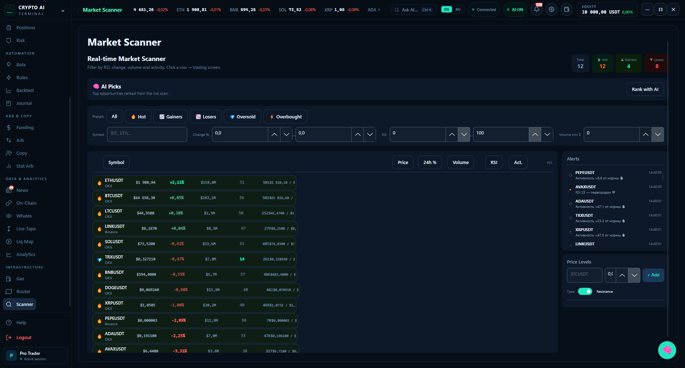

### Settings

Настройки рабочего пространства: выбор модели (Claude или ChatGPT) и её состояние, лицензия и профили,
ключи бирж, сети и параметры DEX, поставщики данных, каналы уведомлений, оповещения, режим исполнения
и горячие клавиши. Счётчики вверху показывают, сколько ключей заполнено. Секреты хранятся локально
в зашифрованном виде — в интерфейсе видны только счётчики, не значения.

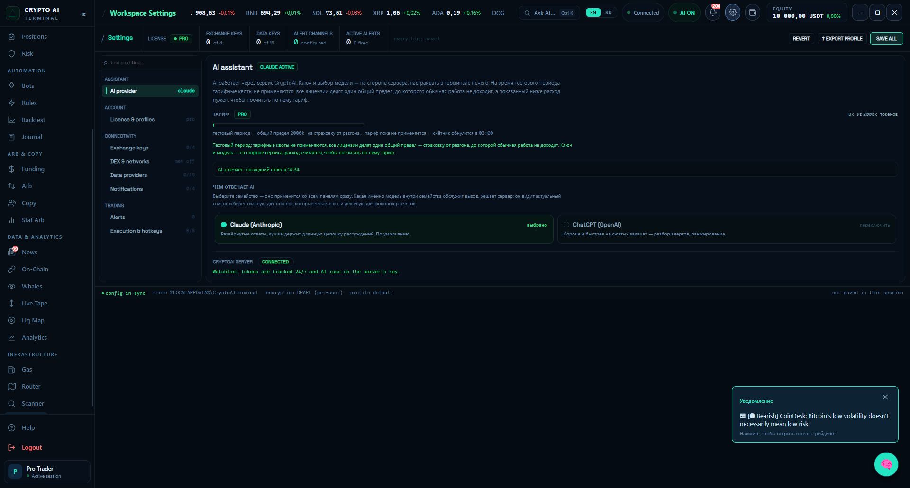

---

## Как устроено

Продукт состоит из двух частей, и вторая необязательна.

**Десктоп-приложение** — self-contained сборка под Windows x64, .NET внутри, отдельно ставить ничего
не нужно. Интерфейс на Avalonia, архитектура MVVM. Вся торговля выполняется здесь: ключи бирж
и приватные ключи кошельков не покидают машину, ордера уходят на площадки напрямую с компьютера
пользователя.

**Серверная часть** — общий бэкенд. Собирает свечи и рыночные данные по отслеживаемым токенам, отдаёт
их клиентам вместо того, чтобы каждый бил по публичным API, и проксирует запросы к моделям, чтобы ключ
вендора не лежал у каждого пользователя. Разворачивается через Docker Compose: ASP.NET Core,
PostgreSQL с TimescaleDB, воркер сбора данных и Caddy для TLS. Без сервера терминал работает автономно.

Лицензии продаёт Telegram-бот с оплатой криптовалютой; терминал проверяет подписанный токен офлайн.
Обновления идут через Velopack — приложение проверяет новую версию и обновляется по подтверждению.

---

## Быстрый старт

**Пользователю.** Скачать `CryptoAITerminal-win-Setup.exe` из
[Releases](https://github.com/090TYPE/CryptoAI/releases), запустить, дальше приложение обновляется
само. Ключи бирж вводятся в настройках; без ключей терминал работает в бумажном режиме на публичных
рыночных данных.

**Из исходников.**

```bash
git clone https://github.com/090TYPE/CryptoAI.git
cd CryptoAI
dotnet run --project CryptoAITerminal.TerminalUI
```

Нужен .NET 8 SDK. Тесты — `dotnet test CryptoAITerminal.Core.Tests`.

**Сборка релиза.**

```powershell
.\build-release.ps1 -Version 1.8.11
```

Собирает self-contained сборку и пакует установщик в `release/`. Выгрузка в GitHub Releases —
отдельный флаг `-PublishToGithub` и переменная `GITHUB_TOKEN`.

**Сервер.** См. [docs/DEPLOY.md](docs/DEPLOY.md).

---

## Режимы и безопасность

**Бумажный режим включён по умолчанию.** Пока он активен, ни один ордер не уходит на биржу: движки,
DEX-свопы, снайпер и переводы работают на симуляции. Состояние стража видно в разделе Risk и в шапке
торгового стола. Живое исполнение включается осознанно и требует действующей лицензии.

**Ключи.** Ключи бирж, токены и приватные ключи кошельков хранятся локально в файле, зашифрованном
средствами Windows под текущего пользователя. На сервер они не отправляются и в логи не пишутся. Ключ
биржи стоит выдавать только с правом торговли, без права вывода, и по возможности ограничивать по IP.

**Риск-лимиты.** Размер позиции, трата на сделку, дневной лимит убытка и потолок открытой экспозиции
задаются в разделе Risk и проверяются перед постановкой ордера.

Торговля криптовалютами сопряжена с риском потери средств. Терминал — инструмент, а не рекомендация.

---

## Стек

**Клиент:** C# · .NET 8 · Avalonia 12 · MVVM · ReactiveUI · SQLite · DPAPI · Velopack
**Сервер:** ASP.NET Core · PostgreSQL + TimescaleDB · Docker Compose · Caddy
**Интеграции:** Binance, Bybit, OKX, KuCoin · Uniswap, Jupiter, SunSwap, Hyperliquid ·
Anthropic API, OpenAI API · Telegram

---

<p align="center">
  <sub>Source-available. Коммерческое использование — по согласованию. См. <a href="LICENSE">LICENSE</a>.</sub>
</p>
